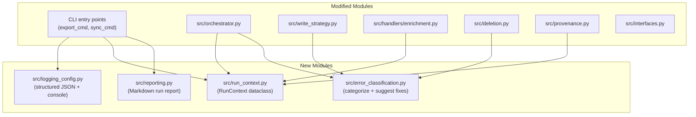

# Observability Overhaul: Logging, Profiling & Error Tracing

Add comprehensive logging, profiling, and error tracing to the datahub-cicd pipeline so that every run produces actionable insights into performance bottlenecks, error causes, and remediation steps -- via structured JSON logs during execution and a human-readable Markdown run report at the end.

## Current State

The codebase has basic logging (`logging.basicConfig` duplicated in both CLI entry points), per-handler timing at the INFO level, and a `SyncResult` dataclass that tracks success/failed/skipped with a string error message. Key gaps:

- **No structured logging** -- plain f-strings, no JSON output, no `exc_info=True` on errors
- **No run-level context** -- no run ID, no phase tracking, no way to correlate log lines
- **Shallow error info** -- `SyncResult.error` is just `str(e)` with no stack trace, error category, or fix suggestion
- **Export phase is fragile** -- a single entity failure in `export()` crashes the entire export (no try/except around per-entity work in enrichment handlers)
- **No API call profiling** -- the biggest bottleneck (N+1 API calls in enrichment: ~5 calls per entity x 10,000+ entities) is invisible
- **Summary is minimal** -- `print_summary()` lists failed URNs but doesn't explain *why* or *what to do next*

## Architecture



## Implementation Tasks

- [ ] Create `src/logging_config.py` -- centralized dual-output (console + JSONL file) logging with structured context fields, configurable log level
- [ ] Create `src/run_context.py` -- RunContext dataclass, contextvar-based phase tracking, TrackedGraph wrapper for API call counting/timing
- [ ] Create `src/error_classification.py` -- `classify_error()` function mapping exception types to categories and actionable fix suggestions
- [ ] Extend `SyncResult` in `src/interfaces.py` with `error_category`, `phase`, `duration_ms`, `suggestion`, `traceback` fields
- [ ] Update `src/orchestrator.py` -- phase tracking, per-entity timing, error classification, enhanced summary with timing waterfall
- [ ] Update `src/write_strategy.py` -- error classification, `exc_info=True`, per-MCP timing
- [ ] Update `src/handlers/enrichment.py` -- per-entity try/except in export loops, enrichment hit-rate metrics, scope efficiency warnings
- [ ] Update `src/deletion.py` and `src/provenance.py` -- `exc_info=True`, error classification, run context integration
- [ ] Create `src/reporting.py` -- generate Markdown run report with timing waterfall, error analysis grouped by category, actionable next-steps checklist
- [ ] Update both CLI entry points -- use `logging_config`, initialize RunContext + TrackedGraph, add `--log-level` flag, generate run report before exit
- [ ] Update existing tests for new `SyncResult` fields; add unit tests for `logging_config`, `error_classification`, `reporting`, and `TrackedGraph`

---

## 1. Centralized Structured Logging (`src/logging_config.py`)

Create a single logging configuration module used by both CLI entry points. Remove the duplicated `logging.basicConfig(...)` from `src/cli/export_cmd.py` and `src/cli/sync_cmd.py`.

**Dual output:**
- **Console**: Human-readable format (current format, with color support for TTY)
- **JSON file**: One JSON object per log line, written to `{output_dir}/run.log.jsonl`

**Structured fields** injected via a custom `logging.Filter`:
- `run_id` (UUID, set once at CLI startup)
- `phase` (export / provenance_filter / enrichment / sync / deletion)
- `entity_type` (when in a handler context)
- `urn` (when processing a specific entity)

**Log level** configurable via `--log-level` CLI flag or `DATAHUB_CICD_LOG_LEVEL` env var (default: INFO).

Design it so an OpenTelemetry handler could be added as a third output later without changing call sites.

## 2. Run Context Tracking (`src/run_context.py`)

A lightweight dataclass + context-var pattern to propagate run metadata through the call stack without passing it as arguments everywhere:

```python
@dataclass
class RunContext:
    run_id: str
    phase: str = ""
    entity_type: str = ""
    start_time: float = field(default_factory=time.monotonic)
    api_calls: int = 0
    api_time_ms: float = 0.0

_current: contextvars.ContextVar[RunContext]
```

Provides:
- `set_phase(name)` context manager -- automatically logged on enter/exit with duration
- `track_api_call(duration_ms)` -- increments counters (used by a thin wrapper or monkey-patch around `DataHubGraph` methods)
- `get_current()` -- returns current context for logging filter

## 3. Enhanced `SyncResult` (`src/interfaces.py`)

Extend the existing dataclass:

```python
@dataclass
class SyncResult:
    entity_type: str
    urn: str
    status: str          # "success" | "failed" | "skipped"
    error: str | None = None
    error_category: str | None = None    # "api_error", "validation", "auth", "timeout", "data_integrity"
    phase: str | None = None             # "export", "build_mcps", "emit", "deletion"
    duration_ms: float | None = None     # per-entity timing
    suggestion: str | None = None        # actionable fix hint
    traceback: str | None = None         # formatted stack trace (debug)
```

All existing code that creates `SyncResult` will be updated to populate the new fields.

## 4. Error Classification & Actionable Suggestions (`src/error_classification.py`)

A pure function that inspects an exception and returns `(category, suggestion)`:

| Exception Pattern | Category | Suggestion |
|---|---|---|
| `ConnectionError`, `ConnectionRefusedError` | `connection` | "Check DATAHUB_*_URL and that the instance is reachable" |
| `HTTPError 401/403` | `auth` | "Check DATAHUB_*_TOKEN -- token may be expired or lack permissions" |
| `HTTPError 404` | `not_found` | "Entity may have been hard-deleted in target -- re-export from dev" |
| `HTTPError 409` | `conflict` | "Concurrent modification detected -- retry the sync" |
| `Timeout` | `timeout` | "DataHub API timed out -- check instance health or increase timeout" |
| `ValidationError`, `ValueError` | `validation` | "Entity data is malformed -- inspect the JSON file for this entity type" |
| `KeyError` on env vars | `config` | "Missing environment variable: set {var} in your env or .env file" |
| Fallback | `unknown` | "Unexpected error -- check the stack trace in the run report" |

Used in `src/orchestrator.py`, `src/write_strategy.py`, and `src/deletion.py` wherever exceptions are caught.

## 5. Performance Profiling

### 5a. Per-Phase Timing (in `src/orchestrator.py`)

Already has coarse timing (`time.monotonic()` around handler export/sync). Enhance to:
- Record timing per phase in `RunContext`
- Track per-entity min/max/avg/p95 duration within each handler
- Log a timing waterfall at the end (which phase took what % of total time)

### 5b. API Call Counting

Wrap the `DataHubGraph` client methods used by the pipeline (`get_urns_by_filter`, `get_tags`, `get_glossary_terms`, `get_domain`, `get_ownership`, `get_aspect`, `emit_mcp`, `get_entity_as_mcps`, `soft_delete_entity`) with a thin timing/counting layer. This provides:
- Total API calls per phase
- Total API wall-clock time per phase
- Average latency per API method

Implementation: a `TrackedGraph` wrapper class in `src/run_context.py` that delegates to the real `DataHubGraph` but increments counters. Instantiated in CLI entry points.

### 5c. Enrichment-Specific Metrics

The enrichment handlers (`src/handlers/enrichment.py`) are the dominant cost center (5 API calls per dataset, 4 per chart/dashboard). Add:
- Per-entity-type scan count and timing
- Count of entities with/without enrichment (hit rate)
- Log a warning when >80% of scanned entities have no enrichment (suggests scope is too broad)

## 6. Export Phase Error Resilience

Currently in `DatasetEnrichmentHandler.export()` and `GenericEnrichmentHandler.export()` (`src/handlers/enrichment.py`), a single API failure during the per-entity loop crashes the entire export. Add per-entity try/except:

```python
for i, urn in enumerate(dataset_urns):
    try:
        # ... existing per-entity logic ...
    except Exception as e:
        logger.error(f"Failed to export enrichment for {urn}: {e}", exc_info=True)
        export_errors.append({"urn": urn, "error": str(e)})
        continue
```

Track export errors and include them in the run report. Same pattern for `_export_common_enrichment()`.

## 7. Run Report Generator (`src/reporting.py`)

Generates a Markdown file (`{output_dir}/run-report.md`) at the end of each CLI command. Sections:

**Header**: Run ID, timestamp, command (export/sync), duration, exit status

**Entity Summary Table**: Per-entity-type counts (exported/synced/failed/skipped)

**Timing Waterfall**: Ordered list of phases with duration and % of total, plus API call counts

**Error Analysis** (if any failures):
- Errors grouped by category (auth, timeout, validation, etc.)
- For each group: count, sample URNs, and the actionable suggestion
- Full list of failed entities with URN, error, and suggestion

**Warnings**: Scope efficiency (e.g., "90% of 15,000 datasets had no enrichment -- consider narrowing scope with --domain or --platform")

**Next Steps**: Auto-generated checklist based on error categories (e.g., "[ ] Rotate DataHub token -- 12 entities failed with auth errors")

Written by the CLI commands right before exit.

## 8. `exc_info=True` on All Error Logs

Across all modules, change `logger.error(f"...: {e}")` to `logger.error(f"...: {e}", exc_info=True)`. This ensures stack traces appear in logs (both console at ERROR level and the JSON log file) without needing to reproduce the error. Key locations:
- `src/orchestrator.py:102` (build_mcps failures)
- `src/write_strategy.py:50` (emit failures)
- `src/deletion.py:114` (soft-delete failures)
- `src/deletion.py:61` (scan failures)
- `src/provenance.py:61` (systemMetadata fetch failures)

## Files Changed Summary

| File | Change |
|---|---|
| `src/logging_config.py` | **New** -- centralized structured logging setup |
| `src/run_context.py` | **New** -- RunContext, TrackedGraph, phase tracking |
| `src/error_classification.py` | **New** -- error categorization and fix suggestions |
| `src/reporting.py` | **New** -- Markdown run report generator |
| `src/interfaces.py` | **Modify** -- extend SyncResult with new fields |
| `src/orchestrator.py` | **Modify** -- phase tracking, per-entity timing, enhanced error handling |
| `src/write_strategy.py` | **Modify** -- error classification, exc_info, per-MCP timing |
| `src/handlers/enrichment.py` | **Modify** -- per-entity error resilience, enrichment metrics |
| `src/deletion.py` | **Modify** -- error classification, exc_info |
| `src/provenance.py` | **Modify** -- exc_info, run context |
| `src/cli/export_cmd.py` | **Modify** -- use logging_config, create RunContext, generate report |
| `src/cli/sync_cmd.py` | **Modify** -- use logging_config, create RunContext, generate report |
| `tests/` | **Modify** -- update tests for new SyncResult fields, add tests for new modules |
